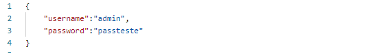

## DriveFood
Aplicação de Venda de Produtos Alimentares
-----------------------------------------------------
 
 

<h1> REST API - Documentação </h1>

<h2>Rotas</h2>
<ul>
  <li>Admin-route</li>
  <li>Encomenda-route</li>
  <li>Entregas-route</li>
  <li>Login-route</li>
  <li>Product-route</li>
  <li>Register-route</li>
  <li>Restaurante-route</li>
  <li>User-route</li>
</ul>

------------------------------------------------------------

<h2>Controller</h2>
<ul>
  <li>Admin-controller</li>
  <li>Encomenda-controller</li>
  <li>Entregas-controller</li>
  <li>Login-controller</li>
  <li>Product-controller</li>
  <li>Register-controller</li>
  <li>Restaurante-controller</li>
  <li>User-controller</li>
</ul>

------------------------------------------------------------

<h2>Config</h2>
<ul>
    <li>Ficheiro sqlite</li>
</ul>

------------------------------------------------------------

<h2>Db</h2>
<ul>
    <li>Ficheiro drivefood</li>
</ul>

------------------------------------------------------------

<h2>Node_Modules</h2>
<ul>
    <li>Ficheiros node_modules</li>
</ul>

------------------------------------------------------------

<h2>Backend</h2>
<ul>
    <li>Ficheiro app</li>
    <li>Ficheiro package</li>
    <li>Ficheiro package-lock</li>
    <li>Ficheiro gitignore</li>
</ul>

-------------------------------------------------------------
<h1>Login e Register</h1>
 

Esta coleção terá os requests relacionados com o iniciar sessão (login) e registar utilizadores (register).

<h1>SuperAdmin</h1>
 

As funções dentro desta pasta só podem ser executadas pelos utilizador do tipo "superadmin".
Foi criado apenas um superadmin e será o único a permitir a criação de administradores.

<h2> POST</h2><h2>Login<h2>
 

Este request é para iniciar sessão.

Campos obrigatórios:

<ul>
    <li>Username: Nome do Utilizador(Aceita texto)</li>
    <li>Password: Password do Utilizador(Aceita texto)</li>
</ul>
 

 URL</h2><h2>Criar Utilizador Cliente

 

localhost:3000/api/register

 
<h3>Body Raw<h3>
 

<h2> POST</h2><h2>Criar Utilizador Cliente<h2>
 

Este request é para criar um cliente.

 

 URL</h2><h2>Criar Utilizador Cliente

 

localhost:3000/api/register
